# Esia

<p align="center">
  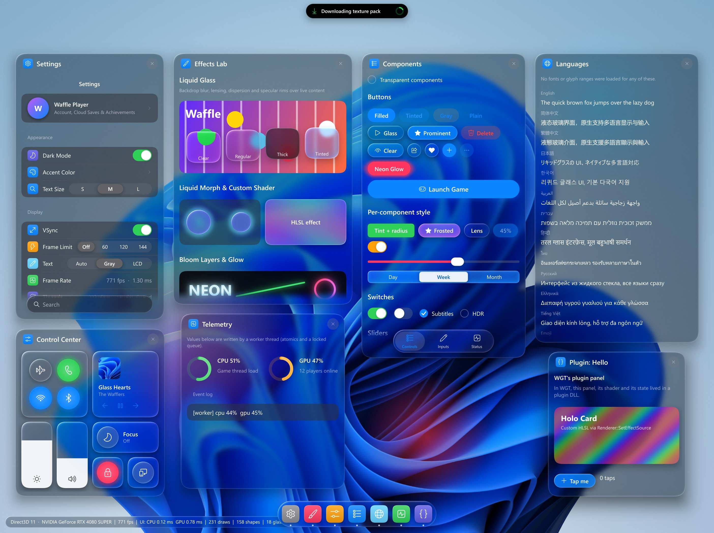
</p>
<p align="center">
  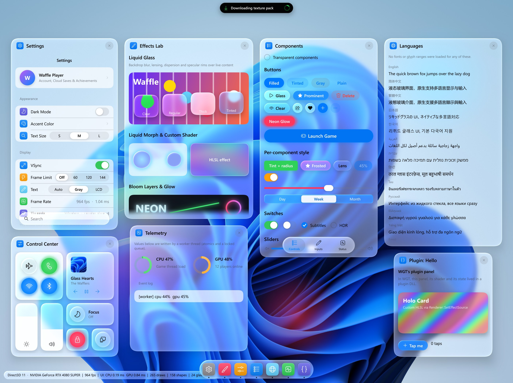
  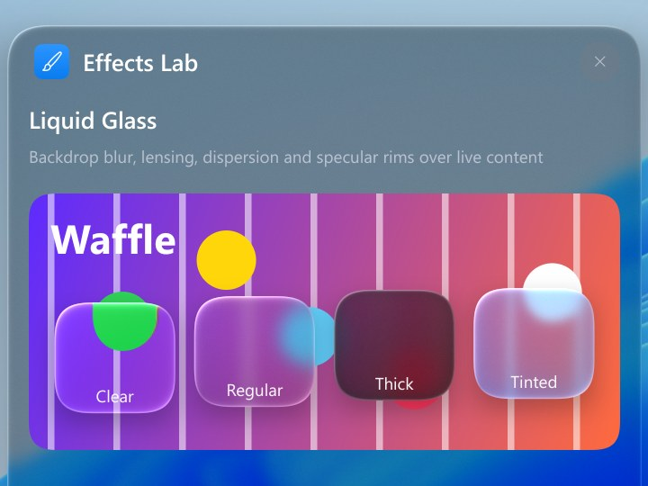
  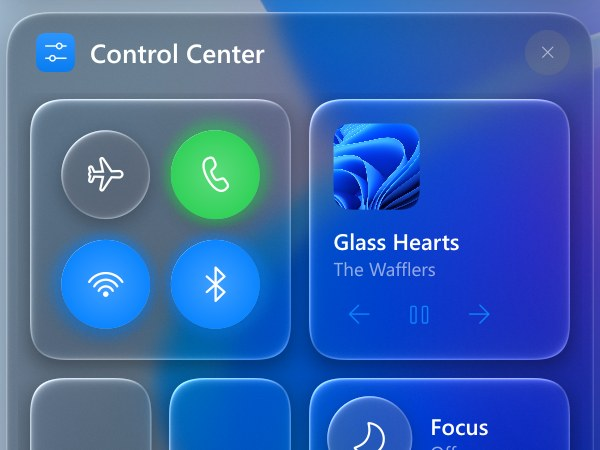
</p>
<p align="center"><sub>The showcase on Windows 11 with Direct3D 11: every panel open, dark and light theme, 2808 x 2100 pixels
at UI scale 1.5 (<code>showcase --spread --size 1872x1400 --scale 1.5</code>). The background is Windows' default
wallpaper.</sub></p>

A liquid-glass (iOS 26 style) UI toolkit for games and tools, in C++20: its own UI core, widgets, renderer and render
hardware interface (RHI), with backends for Direct3D 9 to 12, OpenGL / OpenGL ES, Vulkan and Metal, on Windows, Linux,
macOS, iOS and Android. It replaces WGT UI, the Dear ImGui-based `wgt.dll`; WGT's last version is tag
`wgt-1.1-final`, in this repository's history.

* [Esia and Dear ImGui](#esia-and-dear-imgui) · [Widgets for tools](#widgets-for-tools-the-workbench) ·
  [Status](#status) · [Getting it](#getting-it) · [Building](#building) ·
  [Using it in your project](#using-it-in-your-project) · [Running the examples](#running-the-examples)
* Per system: [Windows](#windows) · [Linux](#linux) · [macOS](#macos) · [iOS](#ios) · [Android](#android)
* [Changing the shaders](#changing-the-shaders) · [Documents](#documents) · [Roadmap](#roadmap) · [Third-party](#third-party) ·
  [License](#license)

## Esia and Dear ImGui

Esia began as WGT, a liquid-glass layer on a modified Dear ImGui, and then replaced ImGui with a core of its own. It
keeps ImGui's model, so its code reads much like ImGui code:

* it is immediate mode: a widget is a function call each frame and returns true when it changed something;
* ids come from labels, with the same `##` convention (`ui::IdScope` for widgets made in a loop);
* windows are `BeginWindow` / `EndWindow`.

What differs is what it draws, how it draws it, and what that costs. There is no compatibility layer: moving a panel
from ImGui to Esia means writing it again with `esia::ui`.

| | Dear ImGui | Esia |
| --- | --- | --- |
| Made for | tools: debug panels, editors, dense data | UI that users see, in the iOS 26 liquid-glass style |
| Look | flat panels and one global style (`ImGuiStyle`, with push / pop of colors and variables) | liquid glass (backdrop blur, refraction, dispersion, specular rims), glow and shadows; a theme whose light and dark modes cross-fade; styles per widget or per block; three glass looks; two densities: iOS's sizes, or a compact one for tools (one line) |
| Motion | none: a change shows on the next frame | springs on every control: the switch's knob, the segmented control's lens, momentum scrolling, panels, the island |
| Rendering | hands the host triangles (`ImDrawData`), drawn in one pass by any renderer that can draw textured triangles with a scissor | its own renderer, several passes per frame (backdrop captures, a blur pyramid, glow layers), through its RHI on Direct3D 9 - 12, OpenGL / ES, Vulkan or Metal |
| GPU cost | a fraction of a millisecond | real, because the glass reads back and blurs what is behind it. The showcase with seven panels at 2808 x 2100 takes about 0.8 ms of GPU time per frame on an RTX 4080 SUPER (Direct3D 11, the picture above), and ran at about 170 fps at 3024 x 1890 on an M3 Pro (2026-10-01); each backdrop capture breaks the render pass, which tile-based GPUs feel most. Flat drawing (`UiDesc::flat`: no glass or shadows) halves a tool's: the workbench 0.20 -> 0.11 ms at 1600 x 1000 |
| CPU cost | small: 0.05 - 0.08 ms to build and submit a frame of a few hundred widgets or 3300 glyphs (Direct3D 11, on the machine of the comparison) | text: less than Dear ImGui's (0.068 ms against 0.076 for 3300 glyphs); plain widgets: more (0.077 ms, 0.064 flat, against 0.052: springs, styles, layout); the glass scene: 0.20 ms against 0.37 for WGT, Dear ImGui with the same glass ([REWRITE_STATUS.md](docs/REWRITE_STATUS.md), "Text against Dear ImGui") |
| Text | its font atlas (stb_truetype, or FreeType). Text is not shaped, so scripts that need shaping (Arabic, Devanagari and the other Indic scripts) do not come out right, and there is no right-to-left | FreeType + HarfBuzz shaping, the system's fonts with a fallback chain for every major script, editing by grapheme, IME composition in the field (Windows, macOS, iOS), color emoji (bitmap and COLR fonts: Apple Color Emoji, Segoe UI Emoji, Noto Color Emoji). A line in one direction is right; mixed directions wait for the bidi algorithm |
| Widgets | a large set: tables, trees, number inputs and drags, color pickers, plots, multi-line text, docking, multiple viewports; extensions add more (ImPlot, node editors) | iOS-style: buttons, switches, sliders, steppers, segmented controls, inset grouped lists, navigation stacks, tab and search bars, menus, pickers, tooltips, text fields, a line chart, the island and the dock. For tools: number and vector fields (scrub, type an expression), a color picker, tables (only the rows in view are drawn: a million rows; sort, resize, select), trees, a multi-line editor, docking, plots (lines, areas, scatter, bars, histograms; a legend, a crosshair, pan and zoom) and a donut chart. Fewer plot kinds than ImPlot, no node editors, no multiple viewports |
| Debugging UI code | items with one id highlighted, with a message, under the mouse (`io.ConfigDebugHighlightIdConflicts`, on by default); the Metrics / Debugger window (windows, draw commands, internal state), the ID Stack Tool, the Item Picker, a debug log, error recovery | a debug build reports, once each and outlined in red: two items with one id, two scroll areas with one id, an item laid out where it cannot be seen ([UI_CORE.md](docs/UI_CORE.md) section 16); no debugger windows |
| Integration | copy a few files; platform and renderer backends exist for almost everything (Win32, GLFW, SDL, Android, Emscripten ...) | a CMake project that needs FreeType and HarfBuzz (found, or downloaded and built with it). The host creates an Esia device on its own device or context and passes a render target each frame. Windows, Linux (X11) and Android have platform layers; on macOS and iOS the host queues the input events itself, as the examples' frames do |
| Touch | touch arrives as the mouse; dragging content does not scroll it | a phone's behavior: a finger scrolls a list from anywhere, a row or a slider included, without pressing them; a tap presses, a sideways drag moves a slider. A mouse keeps a desktop's: the wheel and the scroll indicator scroll. The showcase lays itself out for a phone |
| Platforms | anywhere that can draw triangles: desktop, mobile, web, consoles | Windows, Linux, macOS, iOS, Android |
| Threads | a context is used from one thread at a time | one UI thread per context; nothing process-wide but the font caches (locked); the widget layer's current `Ui` is per thread, one frame at a time; the input queue and the texture registry are thread-safe; worker threads post to the UI (the island's notifications) |
| Maturity | more than ten years old, used in a great many games and engines, with extensions (ImPlot, node editors), bindings for many languages and a stable API | new in 2026: the API can still change, it installs as a CMake package (`find_package(Esia)`) but has no vcpkg or Conan port, and one team works on it |

**Strengths of Esia:**

* how the UI looks and moves: liquid glass, springs on every control, light and dark themes that cross-fade;
* correct text in every major script, with the system's fonts and color emoji;
* less CPU where frames are heavy: a frame of text costs less than Dear ImGui's (0.068 ms against 0.076), the glass
  showcase about half of what WGT's Dear ImGui took (0.20 ms against 0.37), with less GPU time too (0.40 ms against
  0.44, Direct3D 11);
* appearance in one line each: dark or light, the glass look, the accent, a compact density for tools, styles per
  widget or per block rather than one global style;
* one renderer for Direct3D 9 - 12, OpenGL / ES, Vulkan and Metal, tested against the same golden images on each,
  with the APIs' validation layers counted;
* the same UI on a desktop and a phone: touch, the safe area, layouts for a phone, desktop scrolling with a mouse.

**Weaknesses of Esia:**

* GPU time: the glass reads back and blurs what is behind it - about 0.8 ms for the seven-panel showcase at
  2808 x 2100 on an RTX 4080 SUPER - and plain widgets take about twice Dear ImGui's (0.051 ms against 0.025), 1.2
  times with flat drawing (`UiDesc::flat`: no glass or shadows, 0.030 ms);
* plain widgets take more CPU than Dear ImGui's, flat or not (0.077 ms, 0.064 flat, against 0.052): springs,
  styles, layout and hit records, and shapes and glyphs written as vertices on the CPU;
* a smaller widget set: no node editors, no multiple viewports, and fewer plots than ImPlot (no log or time axes, no
  second y axis, no heatmaps or error bars);
* integration: FreeType and HarfBuzz (downloaded and built with Esia when the system has none); platform layers for
  Win32, X11 and Android only - on macOS and iOS the host passes the input on itself, as the examples' frames do -
  and no native Wayland window (XWayland);
* no web and no consoles;
* young: new in 2026, the API can still change, no vcpkg or Conan port.

**Use Esia** for the UI users see: a game's menus and overlays, a launcher, an application's settings, a tool that
should look like a product (tables of a million rows, docking, the compact density). It fits where the glass, the
motion and the text matter and about a millisecond of GPU time is affordable.

**Use Dear ImGui** for internal tools and debuggers that live on ImGui's ecosystem (ImPlot's range of plots, node
editors, multiple viewports), for the smallest integration and GPU cost, or on a platform Esia does not run on (the web, consoles).

## Widgets for tools: the workbench

<p align="center">
  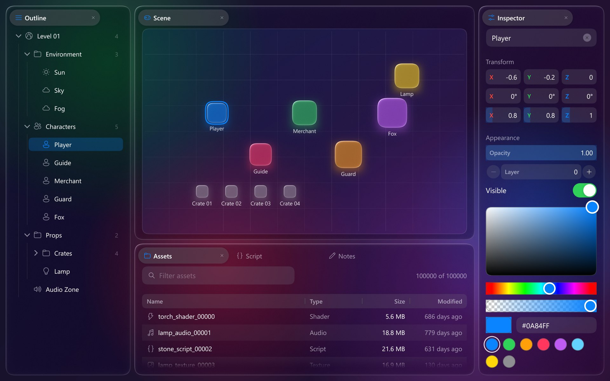
  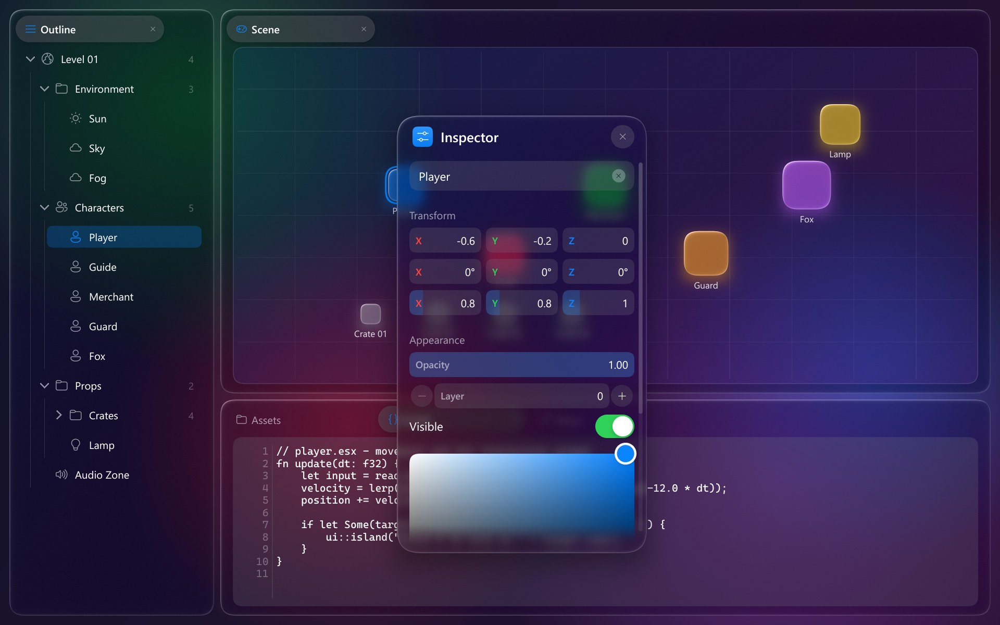
</p>
<p align="center">
  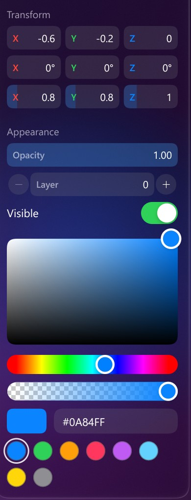
  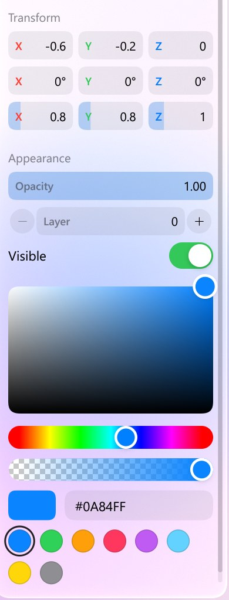
</p>
<p align="center"><sub>The workbench on Windows 11 with Direct3D 11 at UI scale 1.5: docked; with the inspector
floating over the dock space and the script editor's tab in front; the inspector's number, vector and color fields in
the dark and the light theme (<code>workbench --size 1280x800 --scale 1.5 [--float Inspector --show Script] [--light]</code>).</sub></p>

The data widgets, in the same glass style as the rest (`esia::ui`, [UI_WIDGETS.md](docs/UI_WIDGETS.md) section 12):

* **Docking.** Drag a window by its header over a dock space: glass targets show where it would go (into a node's
  tabs, or beside it) and it docks when let go. Drag a tab out and the window floats again, still under the pointer;
  the lines between the panels resize them. Docked windows are ordinary `BeginWindow` code; the layout saves and
  loads as text.
* **Tables** with a million rows cost what the rows in view cost: sortable and resizable columns, rows selected with
  a click, Ctrl and Shift, icons in cells, any widget in a cell.
* **Trees**: an arrow that turns, children that slide open with a guide line, icons and details.
* **Number and vector fields**: drag sideways to scrub, click to type a value or an expression (`2*(3+4)`), Up and
  Down to step; a field with limits fills in proportion to its value.
* **Color picker**: a spectrum, hue and opacity bars, the hex value and swatches, or a round color well that opens it.
* **Multi-line editor**: wrapping, line numbers, the monospace font, Tab, undo, the clipboard and IME composition.
* **Plots**: lines (with the area under them, straight or smooth), scatter, grouped bars and histograms over axes
  with round ticks and a grid; a legend under the plot whose entries hide and show their series; a crosshair and a
  readout of every series under the mouse; drag to pan, the wheel to zoom around the mouse, a double click to fit the
  data again. A line of a million points draws what its pixels show. `PieChart` is a donut whose segment under the
  mouse grows and shows its value in the hole.

  ```cpp
  if (ui::BeginPlot("frame time", {.height = 220, .yFormat = "%.1f ms"})) {
      ui::PlotLine("CPU", cpu);
      ui::PlotLine("GPU", gpu, {.fill = true});
      ui::EndPlot();
  }
  ```
* **Compact density** for tools, in one line: `desc.density = ui::Density::Compact` when creating the `Ui`, or
  `ui.SetDensity(ui::Density::Compact)` (animated; kept across theme and dark-mode changes). The text keeps its size;
  controls get shorter, their shadows and glass with them, so the glass does not outweigh them (buttons 36 -> 30, fields
  32 -> 26, table rows 34 -> 28, list rows 44 -> 34, window headers 54 -> 40; [UI_WIDGETS.md](docs/UI_WIDGETS.md)
  section 2). `workbench --compact`, or Ctrl+Shift+D while it runs.
* **Flat drawing** where the GPU matters more than the glass: `desc.flat = true` (or `ui.SetFlat(true)`). No glass,
  shadows or glows - windows and bars are solid - and rounded rectangles, capsules and circles become a few quads on
  the text's texture, batched with the text: the workbench's GPU time at 1600 x 1000 goes from 0.20 to 0.11 ms, 68
  draws to 53. `workbench --flat`, or Ctrl+Shift+F while it runs.
* **On a desktop** scroll areas show their indicator at rest and the mouse scrolls with the wheel and the indicator;
  a finger drags the content, as on a phone.

```
workbench                                  # the docked layout (glass_window's options apply too)
workbench --float Inspector --show Script  # a window floating, the editor's tab in front
workbench --rows 1000000 --light           # a million rows, light theme
workbench --compact                        # the compact density (Ctrl+Shift+D switches it while running)
workbench --flat                           # no glass or shadows (Ctrl+Shift+F switches it while running)
workbench --float Graphs                   # the plots in a floating window
```

<p align="center">
  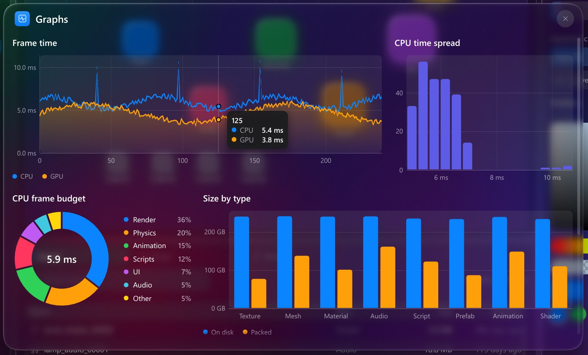
</p>
<p align="center"><sub>The Graphs panel floating, the mouse over the frame times (<code>workbench --size 1600x1000
--scale 1.5 --float Graphs --hover 700,400</code>).</sub></p>

## Status

| Part | State |
| --- | --- |
| UI core (`src/esia/core`) | second version ([UI_CORE.md](docs/UI_CORE.md)): ids, input (touch included), windows with per-window DPI, front-to-back hit testing, press and key ownership, containers and layout providers, child scroll regions, popups and tooltips, per-id state, draw lists, texture registry, debug checks for mistakes in UI code |
| Widgets (`src/esia/ui`, `esia::ui`) | WGT's liquid-glass widgets on the core ([UI_WIDGETS.md](docs/UI_WIDGETS.md)): themes, per-widget styles, springs, auto layout, controls, lists, navigation, popups, text fields, charts, the island; and widgets for tools: number, vector and color fields, tables, trees, a multi-line editor, docking, plots |
| Renderer (`src/esia/render`) | Painter, frame planner, liquid glass (backdrop captures, blur pyramid, refraction), glow layers, edge fades, GPU profiling |
| Text (`src/esia/text`) | analytic glyph rasterizer, glyph atlas, FreeType + HarfBuzz text system (bundled or the system's), system font lookup with fallback chains for every major script, color emoji from bitmap strikes (sbix, CBDT) and COLR fonts (gradients, transforms, composite modes), grayscale antialiasing |
| Backends (`src/esia/rhi/<name>`) | DirectX (Direct3D 9 / 10 / 11 / 12, in `rhi/directx`), OpenGL 3.3 / OpenGL ES 3.0, Vulkan 1.1+, Metal; and `rhi/null`, a device without a GPU that records the command stream and checks the call rules (the tests' and the golden logs') |
| Platform | layers as libraries for Win32 (`src/esia/platform/win32`, [PLATFORM_WIN32.md](docs/PLATFORM_WIN32.md)), X11 (`src/esia/platform/x11`) and Android (`src/esia/platform/android`); the examples' own frames on AppKit (macOS) and UIKit (iOS) |
| Examples | `showcase` (WGT's demo on Esia), `workbench` (a tool's layout on the data widgets) and `glass_window` (a smoke test of the whole path) |

| Backend | CMake option | Systems | Verified on |
| --- | --- | --- | --- |
| DirectX: Direct3D 11, 12, 10, 9 | `ESIA_BACKEND_DIRECTX` | Windows | Windows 11, NVIDIA RTX 4080 SUPER and an AMD Radeon iGPU, debug layers (the tests: D3D12 GPU-based validation); WARP in CI; Direct3D 9 - 11 under Wine |
| OpenGL, OpenGL ES | `ESIA_BACKEND_OPENGL` | Windows, Linux, Android | NVIDIA (WGL), Mesa llvmpipe (WGL, EGL), VMware SVGA3D (EGL on X11), the Android 15 emulator (OpenGL ES) |
| Vulkan | `ESIA_BACKEND_VULKAN` | Windows, Linux, Android | NVIDIA and Mesa lavapipe, Khronos validation layer; the Android 15 emulator |
| Metal | `ESIA_BACKEND_METAL` | macOS, iOS | MacBook Pro (M3 Pro, macOS 27), GitHub's arm64 runner (macOS 15), iPhone 18 Pro Max (A20 Pro, iOS 27); Metal API and shader validation |

Every backend passes the conformance suite (17 scenes against golden images, single frame and across frames, with
the API's validation counted) on the hardware above; on the iPhone only the examples ran. CI runs it on Linux (llvmpipe, lavapipe), on Windows (WARP:
Direct3D 9 and Vulkan only compile there) and on macOS ([CI.md](docs/CI.md)). Details and numbers are in
[REWRITE_STATUS.md](docs/REWRITE_STATUS.md); each backend's `STATUS.md` is the dated record of its bring-up.

| System | Library and tests | Example window |
| --- | --- | --- |
| Windows 10 / 11 | yes | yes: DirectX, OpenGL, Vulkan |
| Linux | yes | yes: OpenGL, Vulkan (X11, XWayland on Wayland) |
| macOS 11+ | yes | yes: Metal |
| iOS 16+ | the library (CI builds it); the tests do not run on iOS | yes: Metal |
| Android 9+ (API 28) | yes, on the Android 15 emulator (no real phone yet) | yes: OpenGL ES, Vulkan (APKs) |

## Getting it

Clone the branch of your graphics API: it holds that backend and what builds it on every system it runs on (the
example frames, the tests, the presets), and its README has the commands.

| Branch | Backend | Systems |
| --- | --- | --- |
| `directx` | Direct3D 11, 12, 10, 9 (the first that works on the machine, or `--api d3d12` ...) | Windows |
| `opengl` | OpenGL 3.3 / OpenGL ES 3.0 | Windows, Linux, Android |
| `vulkan` | Vulkan 1.1+ (the Vulkan SDK / headers) | Windows, Linux, Android |
| `metal` | Metal | macOS, iOS |

```
git clone -b directx https://github.com/0xDEADBEEFC0DEBABE/EsiaGUI.git
```

The branches are made from `main` after every push to it (`tools/branches/backend_branches.py`, the `Backend branches`
workflow): do not commit to them. `main` has every backend, the development history and the documents; it builds the
same way.

## Building

Every system builds with a CMake preset, and the backends of the system are on by default: nothing to choose first.
The commands and what to install are in each system's section: [Windows](#windows), [Linux](#linux), [macOS](#macos),
[iOS](#ios), [Android](#android).

| System | Presets | Backends built by default |
| --- | --- | --- |
| Windows | `windows-msvc`, `windows-clang-cl` | DirectX (Direct3D 9, 10, 11, 12) and OpenGL; Vulkan too when the Vulkan SDK is installed |
| Linux | `linux-clang`, `linux-clang-release`; `windows-mingw-cross`, `windows-cross` build the Windows backends (from macOS too) | OpenGL; Vulkan too when the Vulkan headers are installed |
| macOS | `macos-clang` | Metal |
| iOS | `ios`, `ios-simulator` | Metal |
| Android (from any of them) | `android` | OpenGL ES and Vulkan |

* Configuring prints the list (`-- Esia backends: ...`). `-DESIA_BACKEND_<NAME>=ON` or `OFF` adds or drops one
  (`DIRECTX`, `OPENGL`, `VULKAN`, `METAL`); with DirectX on, the advanced `ESIA_BACKEND_D3D9` / `D3D10` / `D3D11` /
  `D3D12` leave out single Direct3D versions.
* `-DESIA_WERROR=ON` turns warnings into errors. CI builds these presets with it, without a warning: `windows-msvc`,
  `windows-clang-cl`, `linux-clang`, `linux-clang-release`, `windows-mingw-cross`, `macos-clang` and `ios`.
* Text: with `ESIA_TEXT_FREETYPE` on (the default), FreeType and HarfBuzz come from the system, or are downloaded at
  configure time and built with the project (`ESIA_TEXT_DEPS=auto|bundled|system`). Offline, point
  `FETCHCONTENT_SOURCE_DIR_ESIA_FREETYPE` / `..._HARFBUZZ` at extracted sources.
* Every preset puts the examples in `build/<preset>/bin` (`showcase`, `workbench`, `glass_window`; Visual Studio's
  generator in `bin\Release` or `bin\Debug`; Android: APKs in `build/android/apk`). `ESIA_BUILD_EXAMPLES` builds them
  when Esia is the top-level project.
* Tests: `ctest --preset <preset>` runs them, the conformance suite on the machine's GPU included, for the presets
  that build them: `windows-msvc` (a Debug build: `cmake --build --preset windows-msvc-debug` first),
  `windows-clang-cl`, `linux-clang`, `linux-clang-release` and `macos-clang`. `ios`, `ios-simulator`, `android` and
  `windows-cross` build no tests.

## Using it in your project

Add the repository (or a backend branch) as a subdirectory, or install it and find its package; either way the
targets have the same names:

```cmake
add_subdirectory(EsiaGUI)   # the examples are left out when Esia is not the top-level project
# or, after `cmake --install build/<preset> --prefix <dir>` (and CMAKE_PREFIX_PATH=<dir> for the application):
find_package(Esia CONFIG REQUIRED)

target_link_libraries(my_app PRIVATE
    esia::ui                # the widgets, with the core, the renderer and the text interface
    esia::text_ft           # the FreeType + HarfBuzz text system
    esia::backends          # every backend this build has, behind the RHI's registry
    esia::platform_win32)   # or esia::platform_x11, esia::platform_android; none on macOS and iOS
```

The install holds the static libraries of the backends that build had, their headers and the package
(`lib/cmake/Esia`); the package finds again what the libraries need (FreeType and HarfBuzz when they came from the
system, X11, fontconfig). `tests/package` is such an application, built and run by the `esia_package` test.

A frame is `Context::NewFrame`, `Ui::NewFrame`, the widgets, `Ui::EndFrame`, `Context::EndFrame`, then the renderer
draws `Context::GetDrawData()` into the host's target ([UI_WIDGETS.md](docs/UI_WIDGETS.md) section 1). The smallest
host is `examples/glass_window` (`app.hpp`, `host_*.cpp` per API); the Win32 layer is in
[PLATFORM_WIN32.md](docs/PLATFORM_WIN32.md). In a debug build, the core reports ids two widgets share and widgets laid
out out of view ([UI_CORE.md](docs/UI_CORE.md) section 16); what else trips people up is in
[UI_WIDGETS.md](docs/UI_WIDGETS.md) section 14.

Every appearance setting is one line, at creation (`UiDesc`) or while running (`Ui`), and each keeps the others:

| | at creation (`ui::UiDesc desc`) | while running (`ui::Ui ui`) |
| --- | --- | --- |
| dark or light | `desc.theme = ui::ThemeDark();` | `ui.SetDarkMode(true);` |
| density | `desc.density = ui::Density::Compact;` | `ui.SetDensity(ui::Density::Compact);` |
| glass look | `desc.glassLook = ui::GlassLook::Clear;` | `ui.SetGlassLook(ui::GlassLook::Clear);` |
| accent | `desc.theme = ui::ThemeWithAccent(desc.theme, color);` | `ui.SetAccent(color);` |
| everything larger or smaller | `desc.theme.metrics.scale = 1.2f;` | `ui.SetTheme(theme);` with that scale |

Scroll indicators and the mouse's scrolling follow the platform (a desktop's, or a phone's) with nothing to set.

## Running the examples

```
showcase                                   # Settings, Effects Lab and Control Center over a wallpaper, the dock, the island
showcase --open-all --light                # every panel, light theme
showcase --vsync off                       # uncapped frame rate
workbench                                  # the widgets for tools in a dock space
glass_window                               # the smoke test: glass, the core's windows, text and input
```

These options work on every system with an example window (on iOS and Android the app takes the whole screen:
`--size` does nothing there); each system's section lists its own.

| Option | Meaning |
| --- | --- |
| `--api name` | the backend, where more than one is built: see [Windows](#windows), [Linux](#linux) and [Android](#android); macOS and iOS have Metal only |
| `--size WxH`, `--scale s` | client area in UI units (default 1280 x 800), and pixels per UI unit (default: the monitor's); `--size 1512x945 --scale 2` is 3024 x 1890 pixels |
| `--vsync on \| off` | off: no frame cap |
| `--frames N`, `--screenshot out.png`, `--fixed-dt s` | quit after N frames, write the last one (alone: after 60 frames), advance the UI clock by `s` per frame (deterministic captures) |
| `--debug` | the API's validation layer; the message count is printed at exit |
| `--font file` | glass_window: font files instead of the system's (the first is the main one, the others its fallbacks); showcase: the UI font (the first file for regular text, a second for semibold and bold, else the first for all; the fallbacks stay the system's); workbench: the regular-weight UI font (the first file only) |
| showcase: `--open list`, `--open-all`, `--open-later p@n`, `--spread`, `--light`, `--look l`, `--tab n`, `--page id`, `--menu` | the panels to open (`settings,effects,control,components,languages,telemetry,plugin`, or `none`; default: the first three), every panel, panel `p` opened at frame `n`, every panel laid out side by side for a 1872 x 1400 window (add `--size 1872x1400`), the light theme, the glass look (`theme`, `clear`, `frosted`: the default), the Components panel's tab (0 - 2), the Settings page shown first (`accent`, `perf`), the Components panel's menu open |
| workbench: `--float window`, `--show window`, `--rows N`, `--light` | a window floating instead of docked (`Scene`, `Outline`, `Inspector`, `Assets`, `Script`, `Notes`), the tab in front, the table's row count, the light theme |
| showcase and workbench: `--compact`, Ctrl+Shift+D (Cmd+Shift+D) | the compact density; the key switches it while running |

## Windows

**Build.** With Visual Studio 2022 and nothing else (or open the folder in Visual Studio: it lists the presets):

```
cmake --preset windows-msvc
cmake --build --preset windows-msvc-release
```

The examples are in `build\windows-msvc\bin\Release`. The tests: `cmake --build --preset windows-msvc-debug`, then
`ctest --preset windows-msvc`. With LLVM instead (clang-cl and lld on PATH, from an "x64 Native Tools" prompt):
`cmake --preset windows-clang-cl`, `cmake --build --preset windows-clang-cl`, `ctest --preset windows-clang-cl`.

**Things to know on Windows**

* **Path length.** Visual Studio's build fails on paths over 260 characters: keep the clone's path under about 140
  characters (`C:\Users\<you>\source\repos\EsiaGUI` is fine), or enable long paths in Windows.
* **Choosing the API.** `--api directx` (the default) starts the first Direct3D version that works on the machine: 11,
  then 12, 10, 9. `--api d3d11 | d3d12 | d3d10 | d3d9 | opengl | vulkan` picks one. The first line printed (and the
  showcase's status bar) names the API and the GPU that started; the Direct3D hosts ask DXGI for the high-performance
  GPU.
* **Vulkan** needs the LunarG Vulkan SDK (https://vulkan.lunarg.com; its installer sets `VULKAN_SDK`) at configure
  time; without it the build has no Vulkan backend and says so.
* **Debug layers.** `--debug` turns on the Direct3D debug layer, which comes with Windows' optional feature "Graphics
  Tools", or the SDK's Khronos validation layer for Vulkan. The tests can add D3D12's GPU-based validation
  (`ESIA_D3D_DEBUG=2`).
* **Shaders.** The Direct3D backends compile their shaders at run time with `d3dcompiler_47.dll`, part of Windows; the
  examples keep them in `%LOCALAPPDATA%\Esia\ShaderCache` (`--no-shader-cache` compiles them again). The same compiler runs
  custom HLSL effects (`Renderer::SetEffectSource`, the showcase's "HLSL effect" and "Holo Card"): only the Direct3D
  backends run them; OpenGL and Vulkan draw those shapes with the built-in shader.
* **Fonts and icons.** The UI uses Segoe UI with the system's fallback chain (Microsoft YaHei, Yu Gothic UI, Malgun
  Gothic, Nirmala UI ...), Segoe Fluent Icons (Windows 11) or Segoe MDL2 Assets (Windows 10) for the icons; the showcase
  draws Windows' default wallpaper. Color emoji come from Segoe UI Emoji, a COLR font painted with its gradients.
* **Mouse and touch.** The mouse behaves as on a desktop: the wheel and the scroll indicator scroll, a drag on a
  window's empty space moves it, a press on a row or a slider presses it. On a touch screen a finger scrolls lists from
  anywhere, rows and sliders included, as on a phone (Windows marks the mouse messages a touch makes; not yet tried on
  touch hardware).
* **Wine.** Direct3D 9 - 11, OpenGL and Vulkan run under Wine (screenshots in
  `examples/glass_window/wine_screenshots`); the Direct3D 12 window host does not start there.
* **Cross-compiling** from Linux or macOS: `cmake --preset windows-mingw-cross` (MinGW-w64), or `windows-cross`
  (clang-cl with the Windows SDK from xwin; not built in CI).

## Linux

<p align="center">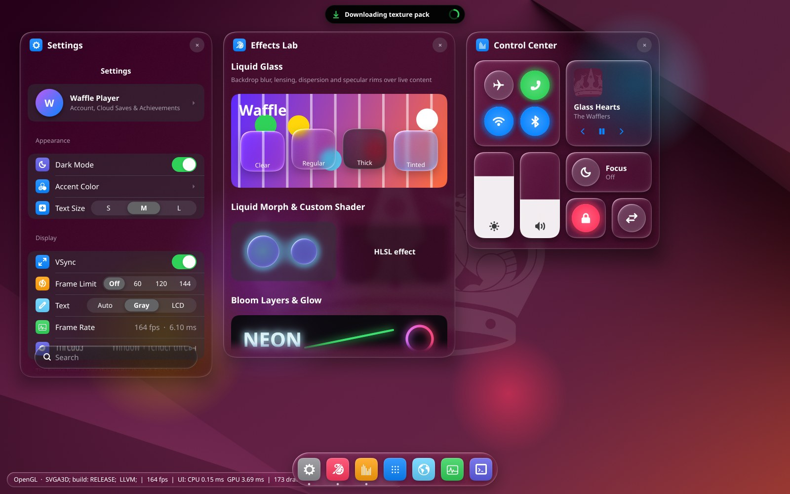</p>
<p align="center"><sub>The showcase on Ubuntu 24.04 (GNOME, XWayland), OpenGL.</sub></p>

**Build.** clang, lld, Ninja and CMake; X11 for the examples' window, EGL for OpenGL, the Vulkan headers for Vulkan,
fontconfig for the fonts (Ubuntu 24.04):

```
sudo apt install clang lld ninja-build cmake libfreetype-dev libharfbuzz-dev libfontconfig-dev libx11-dev libegl-dev libvulkan-dev libjpeg-dev
cmake --preset linux-clang
cmake --build --preset linux-clang && ctest --preset linux-clang
```

The examples are `build/linux-clang/bin/showcase`, `workbench` and `glass_window` (`linux-clang-release` for an
optimized build).

**Things to know on Linux**

* **The window** is an X11 window (the X11 platform layer `esia_platform_x11`, used by
  `examples/glass_window/app_linux.cpp`); on a Wayland desktop (Ubuntu's and Fedora's default) it runs through
  XWayland. `--api opengl` is the default (EGL on the window); `--api vulkan` uses `VK_KHR_xlib_surface`. The UI scale
  follows the desktop's scaling through `Xft.dpi`, or `--scale`.
* **Input.** Mouse, wheel, keyboard and the clipboard (`CLIPBOARD`). Text comes through the input method (IBus, Fcitx
  over XIM): what it commits arrives, but the composition is not shown inline yet.
* **Icons.** esia::ui's icons are drawn from the desktop's symbolic icon theme (Adwaita, else Yaru), rasterized by
  librsvg, which every GNOME desktop has; it is loaded at run time, so nothing is needed to build. Without it the icons
  are left out.
* **Fonts.** The text system finds fonts through fontconfig when it is installed at configure time
  (`libfontconfig-dev`; `-DESIA_TEXT_FONTCONFIG=OFF` to not use it), otherwise by scanning the standard font
  directories. The UI font is Noto Sans (else DejaVu Sans), with Noto Sans CJK, WenQuanYi Zen Hei or Droid Sans
  Fallback for Chinese, Japanese and Korean, a Noto font for every other script (Arabic, Hebrew, the Indic scripts,
  Thai ...) and Noto Color Emoji: install `fonts-noto-core fonts-noto-cjk fonts-noto-color-emoji` for all of them.
* **Wallpaper.** The showcase draws Ubuntu's default wallpaper, else GNOME's (`/usr/share/backgrounds`); JPEG ones
  need `libjpeg-dev` at build time.
* **Headless.** The tests need no window system: OpenGL runs through EGL without one (Mesa's llvmpipe, or the GPU's
  driver), Vulkan without a surface (lavapipe or the GPU's driver), so they run on servers and in CI. `--debug` and the
  tests use the Khronos validation layer when it is installed (`vulkan-validationlayers`).
* **Virtual machines.** In VMware, OpenGL needs 3D acceleration; on virtual hardware 21 (VMware Workstation 17, what
  was used) SVGA3D offers OpenGL 4.3 core. Older hardware versions offer less, down to OpenGL 2.1, which the OpenGL
  host refuses. VMware has no Vulkan driver: `--api vulkan` runs on lavapipe, on the CPU.
* **Custom HLSL effects** need Direct3D: on Linux those shapes draw with the built-in shader.

## macOS

<p align="center">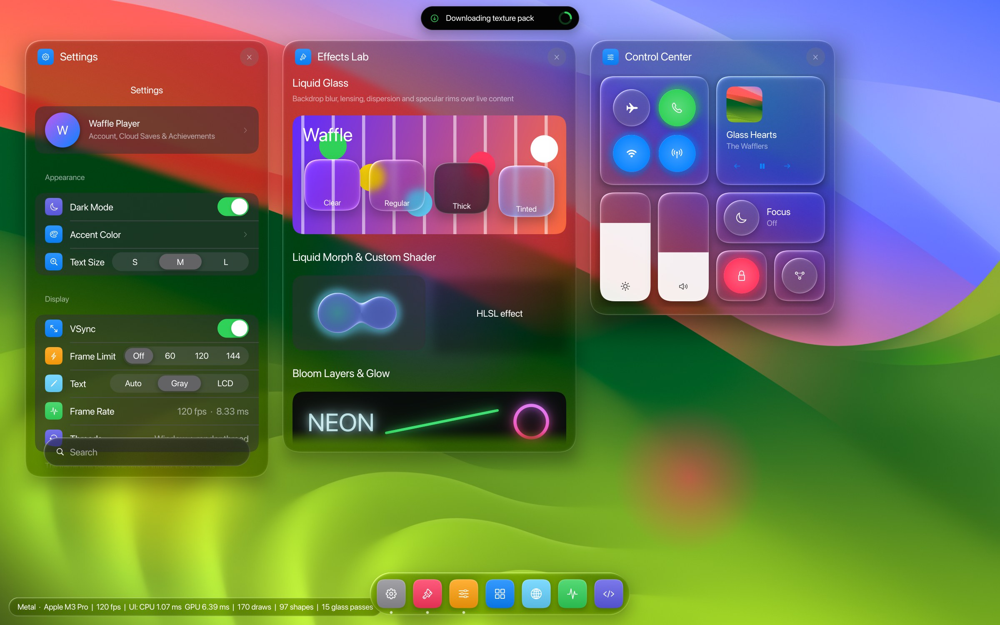</p>
<p align="center"><sub>The showcase on a MacBook Pro (M3 Pro, macOS 27), Metal: 2400 x 1500 pixels at UI scale 1.5
(<code>showcase --size 1600x1000 --scale 1.5</code>).</sub></p>

**Build.** macOS 11 or later; Xcode (the SDK and the Metal compiler) and Homebrew:

```
brew install llvm lld ninja cmake freetype harfbuzz
xcodebuild -downloadComponent MetalToolchain     # only if `xcrun metal` says the Metal toolchain is missing
cmake --preset macos-clang
cmake --build --preset macos-clang && ctest --preset macos-clang
```

The examples are `build/macos-clang/bin/showcase`, `workbench` and `glass_window`.

**Things to know on macOS**

* **Which Macs.** Apple silicon; Intel Macs should work but were never tried. The preset builds for the Mac it runs
  on: for macOS 11, add `-DCMAKE_OSX_DEPLOYMENT_TARGET=11.0` (CI compiles that; it ran on macOS 15 and 27 only).
  `macos-clang` is a Debug build; there is no release preset yet.
* **Validation.** `ctest` runs the Metal conformance suite on the Mac's GPU; set
  `MTL_DEBUG_LAYER=1 MTL_SHADER_VALIDATION=1` for Metal's API and shader validation (CI does). `--debug` turns on the
  API validation for the examples.
* **Frame rate.** A window cannot present faster than the display: with `--vsync off` frames render into offscreen
  targets as fast as they can and the newest is presented each refresh.
* **Options of their own:** `--stats` prints once a second the frame rate, UI / encode / wait times, the GPU time of the
  frame's command buffer, passes, backdrop captures, frames shown and dropped. `--fullscreen` starts in full screen;
  `--fullscreen-at N` toggles full screen at frame N, `--hide-at N` hides the app after frame N. The last two are for
  tests: the frame loop keeps its speed while hidden, and it declares itself latency critical, so macOS does not nap
  it.
* **Fonts and icons.** The examples use the system fonts (SF, the fallback chain of `system_fonts_apple.cpp`, Apple
  Color Emoji), SF Symbols for esia::ui's icons (Windows' icon fonts are not there) and a system wallpaper. The fonts
  FreeType cannot read (PingFang's `hvgl` glyphs) go through Core Text.
* **Performance** (showcase, MacBook Pro M3 Pro, 3024 x 1890 pixels at UI scale 2, `--vsync off`, measured
  2026-10-01, before the batching and capture changes of 2026-10-05): about 170 fps, about 180 fps in the default
  2560 x 1600 window, with the Fx shader specialized per batch through Metal function constants. The GPU's clock
  follows its temperature and load: a hot laptop or another app drawing can halve these for a while. The time went to
  the glass panels' pixels, the drop shadows around them, and the backdrop captures (about 15 per frame then), each of
  which ends and resumes the render pass. Measure with `--stats` or Instruments' Metal System Trace.
* **Limitations.** Custom HLSL effects need Direct3D: Metal draws those shapes with the built-in shader. SF is a
  variable font and the FreeType text system loads its default instance: the UI's bold weights draw as regular.

## iOS

<p align="center">
  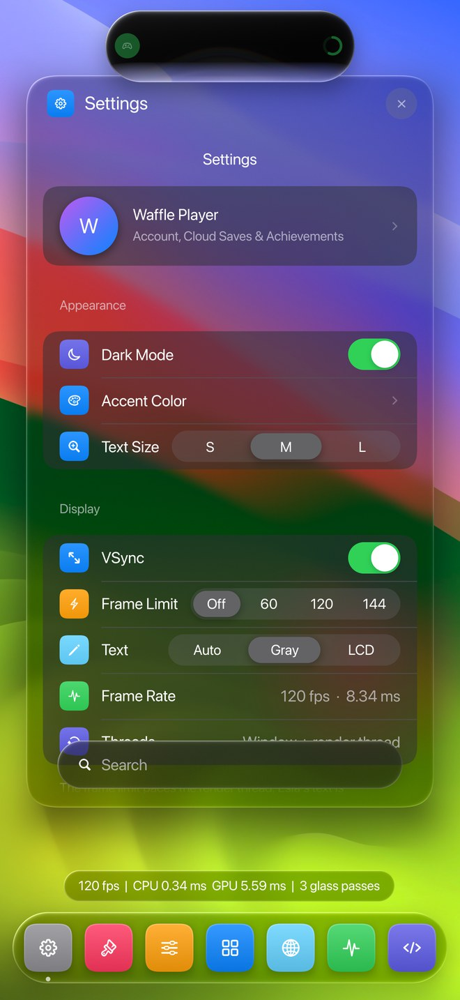
  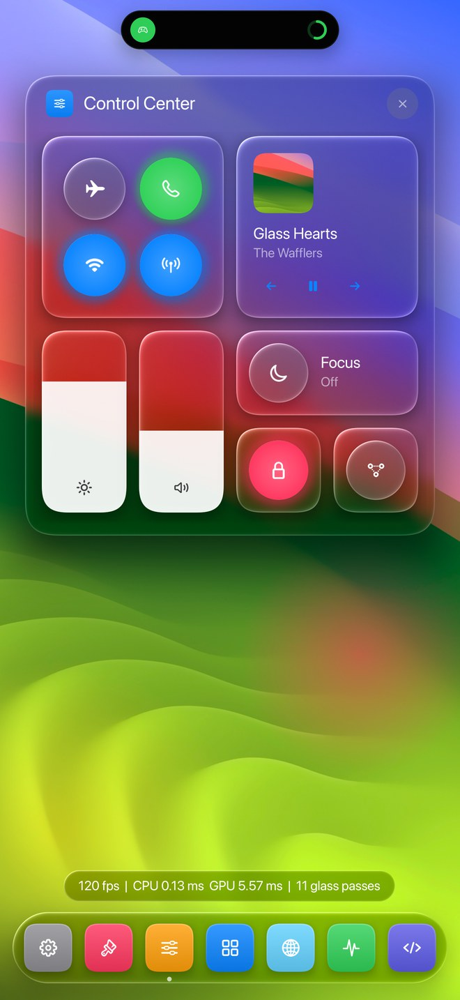
  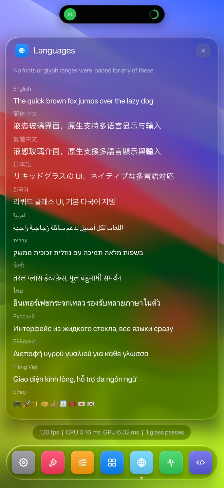
</p>
<p align="center"><sub>The showcase on an iPhone 18 Pro Max (iOS 27), Metal: Settings, Control Center, Languages, screenshots
taken on the phone.</sub></p>

**Build** (iPhones and iPads, iOS 16 or later; on a Mac with Xcode). The examples become app bundles, signed after the
link with a provisioning profile Xcode has for them (`tools/ios/codesign.py`: sign in to Xcode with your Apple ID; a
development or ad hoc profile that lists the device). With the iPhone connected and unlocked:

```
cmake --preset ios && cmake --build --preset ios
xcrun devicectl list devices
xcrun devicectl device install app --device "<name>" build/ios/bin/showcase.app
xcrun devicectl device process launch --console --device "<name>" org.esia.showcase --stats
```

The simulator needs no signing: `cmake --preset ios-simulator && cmake --build --preset ios-simulator`, then
`xcrun simctl install booted build/ios-simulator/bin/showcase.app` and `xcrun simctl launch booted org.esia.showcase`.

**Things to know on iOS**

* **Signing.** `-DESIA_IOS_PROVISIONING_PROFILE=<file>` picks the profile. Without a matching one the build warns and
  the bundle stays unsigned: a device does not install it. `-DESIA_IOS_BUNDLE_PREFIX=` sets the bundle
  identifiers' prefix (default `org.esia`: `org.esia.showcase`, `org.esia.workbench`, `org.esia.glass-window`).
* **Options** are launch arguments (`devicectl device process launch ... org.esia.showcase --vsync off`). The app takes
  the whole screen; `--scale` defaults to the screen's (UI units are points). `--stats` prints the frame statistics as
  on macOS.
* **Input.** The first finger is the mouse: a tap clicks, a drag along a scroll area scrolls it from anywhere (a row or
  a slider included, which then do not press), a sideways drag moves a slider; two fingers scroll anywhere. The
  keyboard comes up for text fields with the system's input methods (pinyin and the like compose inline); a hardware
  keyboard works.
* **Layout.** The examples keep to the safe area the frame passes on (`FrameParams::safeArea`: clear of the camera
  housing and the home indicator), and lay themselves out for a phone: the showcase shows one panel at a time, as large
  as fits, and the dock switches between them; the workbench docks its seven panels as tabs of two (one above the other,
  side by side in landscape), with the asset table's type column left out; glass_window stacks its windows. The island
  grows out of the Dynamic Island: a notification's card shows below the camera, the resident pill only its icon and
  progress beside it.
* **Fonts and wallpaper.** As on macOS; the system's emoji (`emjc` strikes) go through Core Text, and the wallpaper is
  one of the building Mac's, copied into the app.
* **Performance** (measured 2026-10-02). On an iPhone 18 Pro Max (1320 x 2868 pixels) the showcase kept the display's
  120 Hz with about 6 ms of GPU time per frame.
* **Limitations.** As on macOS.

## Android

<p align="center">
  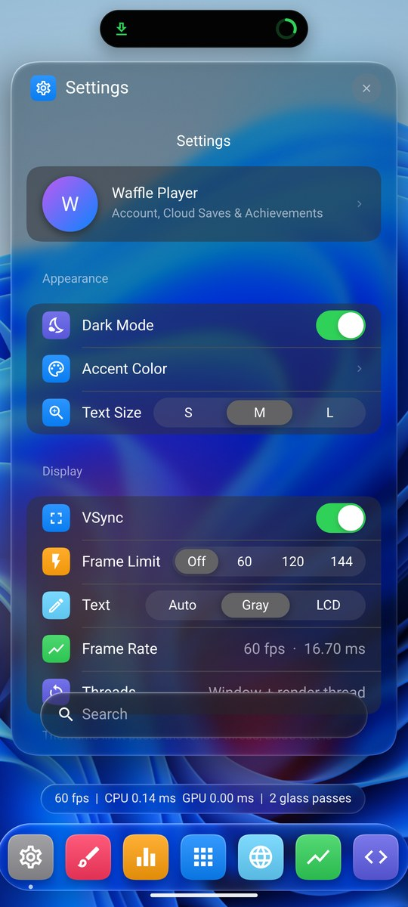
  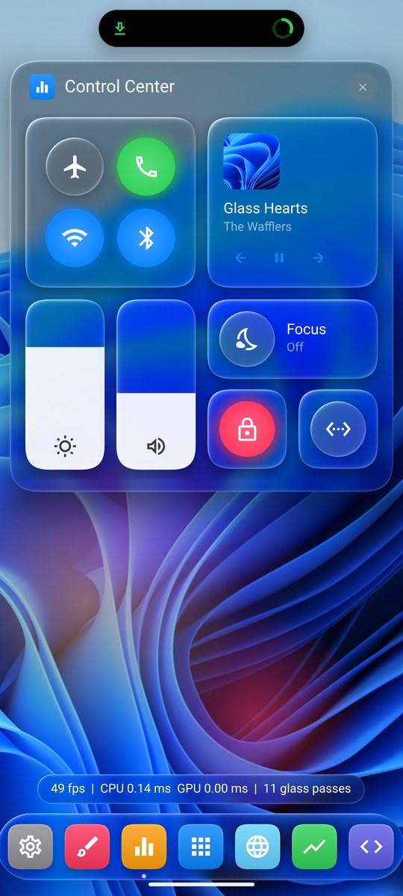
  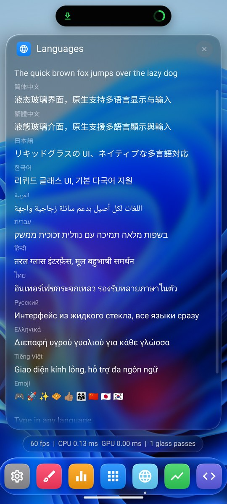
</p>
<p align="center"><sub>The showcase on the Android 15 emulator (a 1080 x 2400 phone), OpenGL ES: Settings, Control Center,
Languages, screenshots taken on the device; the wallpaper is the building PC's.</sub></p>

**Build** (from Windows, Linux or macOS). The Android NDK and SDK (a platform, build-tools and platform-tools; Android
Studio's SDK manager installs them), a JDK for the APK signing tools, CMake and Ninja:

```
export ANDROID_NDK_HOME=<the NDK> ANDROID_HOME=<the SDK>     # set ... in a Windows prompt
cmake --preset android
cmake --build --preset android
adb install build/android/apk/showcase.apk
adb shell "am start -n org.esia.showcase/android.app.NativeActivity -e args '--api vulkan'"
```

The examples become APKs in `build/android/apk` (`showcase`, `workbench`, `glass_window`), built for arm64 phones;
`-DANDROID_ABI=x86_64` builds them for the emulator. No Gradle and no Java code: each example is a shared library
behind Android's `NativeActivity`, packed and signed with a debug key by `tools/android/package.py`. Without the SDK's
build-tools only the shared libraries are built.

**Things to know on Android**

* **Options** come from the launch intent's `args` extra (above: the whole command in one string, or the device's
  shell splits the options): `--api opengl` (OpenGL ES 3.0, the default) or `--api vulkan`, and the options of
  [Running the examples](#running-the-examples). stdout and stderr go to the log (`adb logcat -s esia`); a
  `--screenshot` lands in the app's files (`adb exec-out run-as org.esia.showcase cat files/shot.png > shot.png`).
* **Packages** are `org.esia.<example>` (`org.esia.showcase`, `org.esia.workbench`, `org.esia.glass_window`;
  `ESIA_ANDROID_PACKAGE_PREFIX` changes the prefix).
* **Touch.** The first finger is the mouse: a tap clicks, a drag along a list scrolls it from anywhere (a row or a
  slider included, which then do not press), a sideways drag moves a slider; two fingers scroll anywhere. UI units are
  dp: the scale is the screen's density. The soft keyboard comes up for text fields; the clipboard is Android's.
* **Layout.** As on an iPhone, the showcase shows one panel at a time, as large as fits; the dock switches between them.
  The safe area is the window's insets (the camera's cutout, the system bars, the gesture bar): the island sits around
  the camera, the panels start below it, the dock stays above the gesture bar.
* **The app's lifetime.** Sent to the background, the app drops its window surface and keeps its device, textures and
  UI; brought back, it carries on where it was.
* **Fonts and icons.** Roboto, then a Noto font per script, Noto Color Emoji (a COLR font) and its flags font. Android
  has no icon font for apps: the examples bring Google's Material Icons (Outlined, Apache License 2.0), downloaded when
  configuring (`ESIA_ANDROID_ICON_FONT` names a local copy for offline builds) and packed into each APK.
* **Wallpaper.** An app may not read the user's wallpaper without a permission, so the showcase brings one, as its iOS
  app bundle does: one of the building machine's (Windows', the Mac's, Ubuntu's or GNOME's; `ESIA_ANDROID_WALLPAPER`
  names another) is packed into the APK and decoded by Android. Without one it draws Android's built-in wallpaper.
* **Tests.** The preset builds none (`BUILD_TESTING=OFF`); configured with `-DBUILD_TESTING=ON` they are command-line
  programs to run on the device through `adb shell`. They and the conformance suite passed on the Android 15 emulator
  (OpenGL ES and Vulkan, 2026-10-02).
* **Validation.** The Vulkan validation layer is not in the NDK, and `tools/android/package.py` does not pack it:
  `--debug` on Vulkan says it is missing (Android's loader would find Khronos' `libVkLayer_khronos_validation.so`
  among the APK's libraries). OpenGL ES debug output works where the driver has `KHR_debug`.
* **Limitations.** Verified on the emulator only (Android 15 on an RTX 4080 SUPER); input methods that compose
  (pinyin, kana) do not reach a NativeActivity, so only directly typed text arrives; custom HLSL effects need Direct3D.

## Changing the shaders

`src/esia/shaders/generated` (SPIR-V, GLSL, ESSL, MSL) is generated from the HLSL in `src/esia/shaders` by
`tools/shaders/build_shaders.py`, with the glslang and SPIRV-Cross of Ubuntu 24.04 (CI checks the files byte for byte).
Without those packages, push the shader change to a branch named `shaders/<anything>`: the `Shaders` workflow
regenerates the library and commits it to that branch ([CI.md](docs/CI.md), section 5). Take the generated files into
the commit for `main` and delete the branch.

## Documents

* [CI.md](docs/CI.md): the GitHub Actions jobs (Linux, Windows, macOS), what they prove, how to reproduce them.
* [REWRITE.md](docs/REWRITE.md): the architecture (layers, renderer, RHI, shaders, text, threading, phases).
* [UI_CORE.md](docs/UI_CORE.md): the UI core (input, hit testing, layout, windows, scrolling, popups, debug checks)
  and how widgets use it.
* [UI_WIDGETS.md](docs/UI_WIDGETS.md): the widget layer, its theme and styles, what of WGT is ported, and pitfalls.
* [PLATFORM_WIN32.md](docs/PLATFORM_WIN32.md): the Win32 platform layer and `glass_window`.
* [REWRITE_STATUS.md](docs/REWRITE_STATUS.md): what is done and verified, known issues, next steps.
* [backends/README.md](docs/backends/README.md): how to write and test an RHI backend.
* The backends' bring-up records: [DirectX](src/esia/rhi/directx/common/STATUS.md),
  [OpenGL](src/esia/rhi/opengl/STATUS.md), [Vulkan](src/esia/rhi/vulkan/STATUS.md), [Metal](src/esia/rhi/metal/STATUS.md).
* [tests/fonts/README.md](tests/fonts/README.md): where the test fonts come from.

## Roadmap

1. Platform layers: Cocoa and UIKit as libraries (the examples' AppKit and UIKit frames are the start), then Wayland,
   SDL, and inline IME composition on Linux and Android.
2. Text: the bidi algorithm, variable-font instances (SF's weights), fallback per language and fallback fonts loaded
   when first needed.
3. Performance: fewer render-pass breaks per backdrop capture on tile-based GPUs; FX feature variants on Vulkan and
   OpenGL (the specialization constant is already in the shader library); less CPU for plain widgets.
4. An API reference; vcpkg and Conan ports.
5. Android on real phones (Adreno, Mali GPUs; Android before 15), the Vulkan validation layer in debug APKs.

Known issues (no device-loss handling yet; sRGB targets blend in linear light) are in
[REWRITE_STATUS.md](docs/REWRITE_STATUS.md), section 6.

## Third-party

The text tests use DroidSans (Apache License 2.0), Karla and a subset of Noto Sans SC (SIL Open Font License 1.1) in
`tests/fonts` ([its README](tests/fonts/README.md)). With `ESIA_TEXT_FREETYPE` on (the default), FreeType (FreeType
License) and HarfBuzz (MIT) come from the system or are downloaded at configure time and built from source:
`ESIA_TEXT_DEPS=auto|bundled|system`. The Android examples download Google's Material Icons (Outlined, Apache License
2.0) for their icons at configure time and pack the font into their APKs, and compile the NDK's
`android_native_app_glue`. The iOS app bundles and the Android APKs carry a wallpaper of the machine that built them
(Microsoft's, Apple's, Canonical's or GNOME's image): they are for trying the examples, not for distribution.

## License

Esia is under the MIT License: [LICENSE](LICENSE). The third-party fonts and libraries above keep their own licenses.
